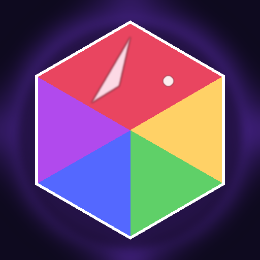

# Jeweled

[](https://github.com/lucasdaddiego/jeweled/actions/workflows/deploy.yml)
[](#testing)


[](LICENSE)
[](https://jeweled.daddiego.com.ar)

A polished match-3 puzzle game — **Zen, Classic, Daily, Blitz, and Puzzles**.
Built as a fast, offline-capable PWA with vanilla JavaScript and an HTML Canvas
renderer — no framework, no runtime dependencies.

🎮 **Play it live:** https://jeweled.daddiego.com.ar



## Game modes

| Mode | What it is |
| --- | --- |
| **Classic** | Level-based progression — hit the score target before you run out of moves. |
| **Blitz** | 60-second score attack. Cascade fast, chain specials, beat your best. |
| **Zen** | Endless, no fail state. A relaxed board you can put down and resume — the run auto-saves. |
| **Daily** | One deterministic board per day (seeded from the date), 30 moves, max score. Everyone gets the same puzzle. |
| **Puzzles** | Hand-crafted puzzle boards with set solutions. |

Plus special gems (line clears, color bombs, fire, lightning, star, wildcard…),
spendable power-ups, an achievements system, a streak/play-history heatmap, and
full English/Spanish localization.

## Tech stack

- **Vanilla JavaScript** (ES modules) — zero runtime dependencies.
- **HTML Canvas 2D** for the entire renderer (gems, particles, waves, bolts, floaters).
- **PWA**: installable, works offline via a service worker with a SHA-versioned cache; web app manifest with maskable icons.
- **Persistence**: `localStorage` behind a small versioned-schema wrapper with forward migrations (`src/storage.js`).
- **i18n**: `en` / `es` with auto-detection (`src/i18n.js`).
- **Hosting**: Cloudflare Pages, auto-deployed from `main` via GitHub Actions.
- **Tested**: [Vitest](https://vitest.dev) + jsdom with a stubbed Canvas 2D context; ~99% coverage enforced as a CI gate (`src/main.js`, `src/render.js`, every scene and the cascade engine all covered).

## Run locally

There is **no build step for development** — the app loads its ES-module
entrypoint (`src/main.js`) directly. Just serve the repo root over HTTP:

```bash
npm run serve          # → npx serve . (correct module MIME types)
# then open http://localhost:3000
```

Any static server works as long as it serves `.js` with a JavaScript MIME type.
A quick alternative (note: some older Python builds serve `.js` as `text/plain`,
which browsers reject for modules):

```bash
python3 -m http.server 8080
```

## Build & deploy

```bash
npm install            # dev tools only (esbuild, html-minifier-terser, wrangler, vitest)
npm run build          # assemble + SHA-stamp dist/ via scripts/build.sh
npx wrangler pages dev dist     # preview the built output locally
```

Production deploys are automatic: **push to `main`** and the
[`deploy.yml`](.github/workflows/deploy.yml) workflow assembles `dist/`,
bundles `src/` into one minified ES module with esbuild, minifies CSS/HTML/SW,
syntax-checks the output, and ships it to Cloudflare Pages.

To deploy manually you need a Cloudflare API token and account id:

```bash
CLOUDFLARE_API_TOKEN=… CLOUDFLARE_ACCOUNT_ID=… npm run deploy
```

In CI these are provided as the repo secrets `CLOUDFLARE_API_TOKEN` and
`CLOUDFLARE_ACCOUNT_ID`.

## Testing

The game logic and the entire render/scene layer are covered by a **Vitest**
suite that runs headless under **jsdom** with a stubbed Canvas 2D context — see
[`test/setup.js`](test/setup.js) and [`test/helpers.js`](test/helpers.js).

```bash
npm test               # run the suite once
npm run test:watch     # watch mode
npm run coverage       # suite + coverage report
```

Coverage is enforced as a CI gate (statements/functions/lines ≥ 99%, branches
≥ 98% — the small remainder is unreachable defensive code kept in the source).
Every pull request runs the suite via [`ci.yml`](.github/workflows/ci.yml), and
a production deploy is **blocked unless the same gate passes** (the `deploy`
job depends on it).

## Project structure

```
index.html          App shell + boot splash; loads src/main.js as a module
style.css           Splash / full-bleed canvas styling
manifest.json       PWA manifest
sw.js               Service worker (precache + offline + cache versioning)
_headers            Cloudflare security headers (CSP, X-Frame-Options, …)
wrangler.jsonc      Cloudflare Pages config (publishes dist/)
src/
  main.js           Boot, scene loop, SW registration
  config.js         Game constants & tunables
  cascade.js        Core match/clear/refill state machine
  grid.js matcher.js specials.js powerups.js   Board + match logic
  render.js animations.js particles.js waves.js bolts.js floaters.js   Canvas rendering & FX
  scenes/           One module per screen (title, game modes, result, stats, …)
  storage.js i18n.js achievements.js …         Persistence, localization, meta
icons/              App icons + locally-bundled Fluent emoji (see credits)
scripts/
  build.sh          Assemble dist/ and stamp the commit SHA
  build-icons.mjs   Regenerate app icons/favicon from inline SVG
  i18n-audit.sh     Lint for untranslated strings / native dialogs
test/               Vitest suite (jsdom + stubbed canvas) — one file per module
vitest.config.js    Test runner + coverage-gate config
```

## npm scripts

| Script | Does |
| --- | --- |
| `npm run serve` | Serve the repo root for local dev (unbundled). |
| `npm run build` | Build the Cloudflare Pages output into `dist/`. |
| `npm run deploy` | Build, then `wrangler pages deploy dist`. |
| `npm run audit:i18n` | Check for localization regressions. |
| `npm run icons` | Regenerate icons (needs `cd scripts && npm install` once — see script header). |
| `npm run check` | `node --check` every `src/*.js`. |
| `npm test` | Run the Vitest suite once. |
| `npm run test:watch` | Vitest in watch mode. |
| `npm run coverage` | Suite + coverage report (the CI gate). |

## Contributing

Issues and PRs are welcome. Run `npm test` before opening a PR — CI runs the
suite + coverage gate on every pull request. If you touch user-facing strings,
also run `npm run audit:i18n` (it flags untranslated text and native dialogs).

## License

[MIT](LICENSE) © Lucas Daddiego.

### Credits

- Emoji glyphs are **[Microsoft Fluent Emoji](https://github.com/microsoft/fluentui-emoji)**, MIT-licensed, bundled locally under `icons/emoji/` (see [`icons/emoji/LICENSE`](icons/emoji/LICENSE)).
